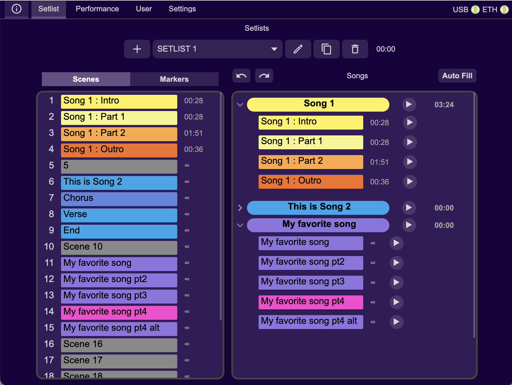

# Desktop Application

This page documents the current desktop app behavior and workflow.

## Main navigation

The app top tabs are:

- **Info**
- **Setlist**
- **Performance**
- **User**
- **Settings**

On the right side of the tab bar, status indicators show:

- **USB** connection state
- **ETH** connection state

---

## Setlist tab

The Setlist tab is the core show-prep area.

### Layout

- **Left column**: source list switch (`Scenes` / `Markers`) + source items
- **Right column**: songs list and setlist controls
- **Top right row**:
  - Undo / Redo
  - Setlist selector
  - New / Rename / Duplicate / Delete setlist actions
  - Total setlist duration

### Setlist workflow

1. Choose **Scenes** or **Markers**
2. Select or create a target setlist
3. Drag items from left column into songs/sections on the right
4. Reorder songs and sections as needed
5. Use **Undo / Redo** for quick corrections

### Setlist management actions

- **Create setlist**
- **Rename setlist**
- **Duplicate setlist**
- **Delete setlist** (with confirmation)

### Notes

- Scene/marker ingestion is intended for Ableton-driven workflows
- Song/section editing supports iterative preparation before a show

---

## Performance tab

Performance is designed as a streamlined live-control view.

- Includes performance display area
- Includes MIDI action buttons area

Use this tab for quick-access live actions, while Setlist/User tabs remain the configuration spaces.

---

## User tab

User page configuration is where you configure hands-on controls.

### Main sections

- **User page selector** (multiple user pages)
- **Config buttons** (load/save/apply style actions depending on mapping state)
- **Pedals strip**
- **Device interface preview**:
  - Shift button
  - Device display card
  - Encoder control
  - Button grid

### What you configure

- Button actions (normal + shifted behavior)
- Encoder turn/push assignments
- Pedal behavior
- Display line content (depending on selected options)
- Custom MIDI messages where applicable

---

## Settings tab

Settings includes both visual device settings and network settings.

### Device settings

- **LED brightness** slider
- **Display brightness** slider

### Network settings

- **IP address** (4 fields)
- **Port**
- **Send** action to apply network values

### Pedal type section

For each pedal input:

- Single Footswitch
- Dual Footswitch
- Expression

---

## Info tab (manual viewer)

Info contains the in-app documentation menu:

- Getting Started
- Hardware
- Application
- Ableset
- Troubleshooting

It also displays app version info.

---

## Best-practice flow before a show

1. Confirm USB/ETH status in tab bar
2. Set brightness and network in **Settings**
3. Finalize setlist in **Setlist**
4. Validate user mappings in **User**
5. Use **Performance** during rehearsal/show
