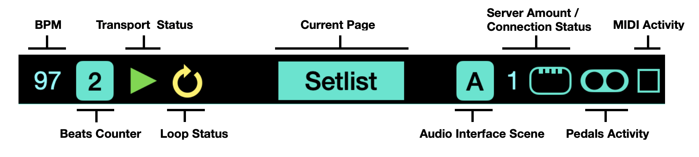
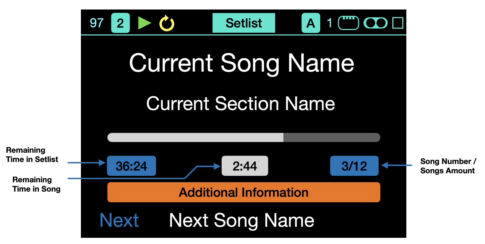
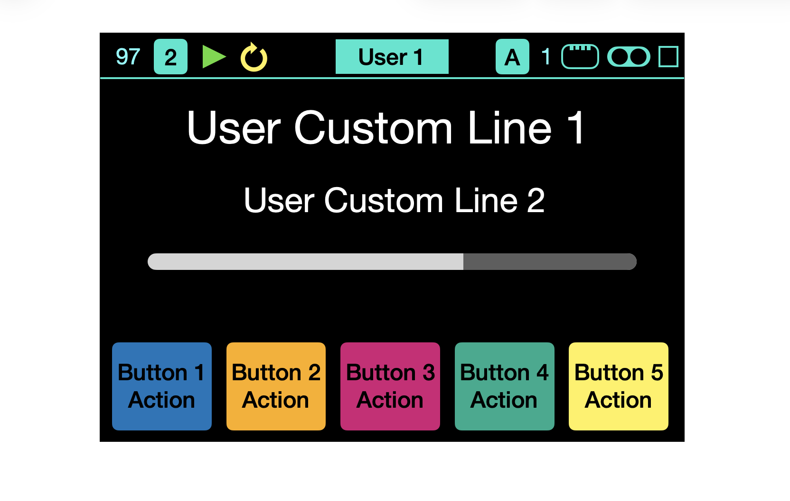

# Show Control Hardware Controller

A practical guide to set up, use, and maintain the controller for live shows.

---

## Hardware & firmware compatibility

Use this section first before any troubleshooting.

- **Controller family:** ShowControl hardware controller
- **Required companion:** ShowControl desktop app
- **Recommended DAW integration:** Ableton Live remote script

### Compatibility checklist

- [ ] Controller boots normally
- [ ] App detects controller over USB and/or Ethernet
- [ ] Your current firmware supports your intended workflow (ShowControl or Ableset)

> If behavior changed after a firmware update, verify app + firmware versions are aligned before deeper debugging.

---

## 1) Setup (before rehearsal)

## Power

The controller can be powered by USB-C and/or PoE.

- If both are connected, **PoE is prioritized**.
- On startup, the welcome page remains visible until a service is available.

### Do / Don’t

- ✅ Do use stable power and quality cables
- ✅ Do test power path before show day
- ❌ Don’t hot-swap unstable power sources during performance

---

## Connection

This table presents required components depending on service and connection type.

| Service | Connection | Show Control App | Ableton Script | Ableset (App + Script) |
|:--:|:--:|:--:|:--:|:--:|
| **Show Control** | **USB** | ● | ✅ | ● |
| **Show Control** | **Ethernet** | ✅ | ✅ | ● |
| **Ableset** | **USB** | ✅ | ● | ✅ |
| **Ableset** | **Ethernet** | ● | ● | ✅ |

---

## Network configuration

ShowControl supports **static IP** setup from the app and controller settings.

- **IP Address**: device address (example: `192.168.1.100`)
- **Port**: OSC port (example default around `42050` depending on your setup)

### Do / Don’t

- ✅ Do keep controller and computer on same subnet
- ✅ Do document your production IP plan
- ❌ Don’t change IP/port during a live section unless necessary

---

## MIDI setup

When connected via USB, two MIDI ports appear:

- **Show Control DAW** — for Ableton Script workflow
- **Show Control External MIDI** — forwards messages from device connected to external USB host port

---

## 2) Show use (on stage)

## Navigation

Long encoder press opens Main Menu. From there you can change the Active Page :

- **Setlist / Ableset page**
- **User pages**
- **Settings page**

| Action | Result |
|--------|--------|
| Long Encoder Press | Navigate menu items |
| Short Encoder Press | Validate selection |
| Press Shift/Lock | Exit without changing |

You can also remotely change the Active Page by sending a MIDI **Program Change** message on the **Show Control DAW port**.
User Pages : PC 1 to 4
Setlist/Ableset Page : PC 5

---

## Top Bar

The top bar is always visible and displays controller status.

| Element | Description |
|---------|-------------|
| **BPM** | Current tempo from DAW |
| **Beat Counter** | Actes as a numeric Metronome |
| **Transport Status** | Play / Stop / Loop indicator |
| **Active Page Name** | Current page (User 1, Setlist, Settings...) |
| **Audio Interface Scene** | Reflects the redundancy Scene of the Audio interface (if available) |
| **Connection Status** | Active path (ETH/USB) |
| **Pedals Activity** | Blinks if pedals used |
| **External MIDI Activity** | Blinks if MIDI received from the USB host MIDI port |

---

## Setlist / Ableset Page

This page displays current setlist and supports Song/Section navigation.

### Controls

| Action | Encoder | Button 1 | Button 2 | Button 3 | Button 4 | Button 5 |
|--------|---------|----------|----------|----------|----------|----------|
| **Press** | Songs List | Play | Stop | Previous Song | Next Song | Toggle Loop |
| **Shift + Press** | Setlists List | Pause | Stop | Rewind | Forward | Toggle Loop |

---

## User Pages

The controller supports up to **4 User pages**, configurable in the app.

Each User page contains:

- 5 primary button actions
- 5 shifted button actions
- encoder action(s)
- display lines

When Shift/Lock is pressed, shifted actions are shown/used.

---

## Settings Page

Configure key hardware parameters directly on the controller.

### Available settings

| Setting | Description | Range |
|---------|-------------|-------|
| **LED Brightness** | Button LED intensity | 1 - 10 |
| **Display Brightness** | Screen brightness | 1 - 10 |
| **Device Id** | Device number | 1 - 10 |
| **IP Address** | Device IP for OSC | 0.0.0.0 - 255.255.255.255 |
| **Port** | OSC communication port | 1000 - 65535 |

### Navigation

| Action | Result |
|--------|--------|
| Turn encoder | Navigate settings / adjust value |
| Press encoder | Edit selected setting |
| Press Shift/Lock | Exit settings |

### Saving changes

- Use **Save & Exit** to persist changes.
- Use Shift/Lock to exit without saving.

---

## External MIDI

USB host port supports external MIDI devices (keyboards, controllers, footswitches).

Messages are forwarded through **Show Control External MIDI**.

### Power considerations

- External USB devices are powered by the controller
- Max current budget is limited
- Use a **powered USB hub** for higher-draw devices

### Do / Don’t

- ✅ Do validate external device power draw
- ✅ Do test with your exact show rig
- ❌ Don’t rely on borderline bus-power on stage

---

## Pedals

2 pedal inputs (6.35mm TRS) support multiple modes.

### Wiring

| Pin | Function |
|-----|----------|
| **Tip** | Signal |
| **Ring** | +3.3V reference |
| **Sleeve** | Ground |

### Pedal types

| Type | Description |
|------|-------------|
| **Expression Pedal** | Continuous control (0-127) |
| **Momentary Footswitch** | Sends value on press/release |
| **Latching Footswitch** | Toggles per press |

### Typical uses

| Pedal | Suggested use |
|-------|---------------|
| **Pedal 1** | Sustain / Looper control |
| **Pedal 2** | Expression / Volume |

---

## 3) Maintenance & troubleshooting

## Specifications (reference)

| Specification | Value |
|---------------|-------|
| **Processor** | RP2040 (Dual-core ARM Cortex-M0+) |
| **Display** | TFT LCD |
| **Buttons** | RGB LED buttons + Shift/Lock |
| **Encoder** | Rotary encoder with push |
| **Pedal Inputs** | 2 × 6.35mm TRS |
| **USB** | USB-C (Device) + USB-A (Host) |
| **Ethernet** | RJ45 (10/100 Mbps), PoE-capable hardware path |

---

## Fast troubleshooting

### Device not detected

1. Confirm data-capable USB cable
2. Try another USB port
3. Reboot controller
4. Verify expected MIDI ports appear

### Network connection failed

1. Verify Ethernet cable and link
2. Confirm IP/port values
3. Ensure same subnet
4. Test with ping from computer

### Display/LED issues

1. Check brightness settings
2. Reboot controller
3. Re-test with minimal setup

---

## Pre-show hardware checklist (30 seconds)

- [ ] Power path stable
- [ ] USB/ETH link validated
- [ ] Correct setlist selected
- [ ] Shift behavior confirmed
- [ ] Pedals confirmed
- [ ] External MIDI device(s) confirmed
